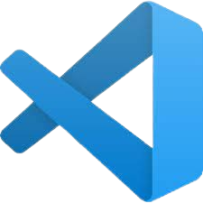

# Runaways
 

## 📋 Description:
**Doma6no is a dedicated website for managing homework assignments. The platform serves both students, teachers, and administrators, providing key functionalities such as: homework submission, grading, and administration.It is a comprehensive solution for modern educational institutions looking to streamline homework management. By catering to the needs of students, teachers, and administrators, it fosters a more organized, efficient, and collaborative learning environment.**

## 🖥 Team Members:
* **Калоян Иванов** - *Back-end developer* 
* **Николай Кулов** - *front-end developer* 
* **Борислав Арсенов** - *Back-end developer*
* **Пламен Тодоров** - *front-end developer* 
* **Дилян Янков** - *Mentor*

## ⚙️ Languages and tools:

  
     
     
    
    
    
    
    
    
